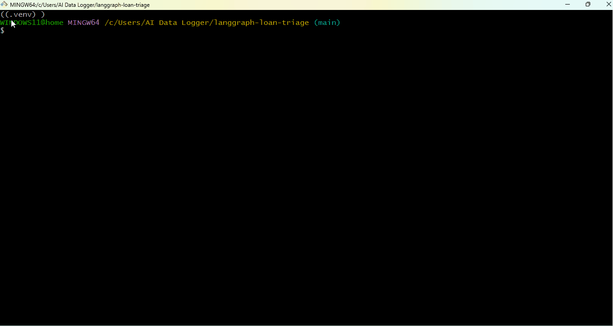

# audit-ledger-mcp

**MCP server for the [AI Audit Ledger](https://github.com/shahidh68/audit-ledger).** Lets any AI agent — Claude Desktop, Cursor, LangGraph, custom — record decisions to a tamper-evident audit trail with one line of config.

Built for teams shipping AI in regulated contexts: EU AI Act Article 12 logging, FCA SS1/23 model risk evidence, GDPR data minimisation. Personal data is hashed locally before any payload leaves the server — the ledger only ever sees fingerprints.

[](https://www.npmjs.com/package/audit-ledger-mcp) [](./LICENSE) [](https://modelcontextprotocol.io)

**[Try the live dashboard →](https://d2pfirb2397ixy.cloudfront.net/?demo=1)** &nbsp;&middot;&nbsp; 30 synthetic decisions written via this MCP server, queryable and verifiable.

<p align="center">
  
</p>

> A LangGraph workflow calls `record_decision` after each agent step. Three audit events written to the live ledger; every one independently verifiable.

---

## What it does

Exposes four tools to any MCP-compatible agent:

| Tool | What it does |
|---|---|
| `record_decision`     | Log an AI decision. Hashes inputs locally, then writes through to the ledger. Returns an event ID. |
| `verify_decision`     | Cross-check a stored record against the immutable S3 Object Lock copy. Returns `integrity_verified: true/false`. |
| `verify_completeness` | Detect deleted or missing records. Compares the ledger's per-tenant counter against the rows actually present and returns any sequence numbers that are gone. The answer to "can you prove the log is complete?" |
| `list_decisions`      | Query recent decisions, optionally filtered by time window. Tenant-scoped by API key. |

Each call ends up as a regulator-grade audit record in your deployed ledger — DynamoDB for query, S3 Object Lock COMPLIANCE mode for the immutable copy, 7-year retention by default.

---

## Quick start — zero configuration

```bash
npx -y audit-ledger-mcp
```

That's it. With no environment variables, the server boots into **sandbox mode** and writes records to a shared public tenant on a hosted ledger. You can try every tool — `record_decision`, `verify_decision`, `verify_completeness`, `list_decisions` — without provisioning anything.

When sandbox mode is active, you'll see a banner on stderr:

```
[audit-ledger-mcp] ─────────────── SANDBOX MODE ───────────────
[audit-ledger-mcp] No AUDIT_API_URL configured.
[audit-ledger-mcp] Using the public sandbox at sandbox-public.
[audit-ledger-mcp]   View: https://d2pfirb2397ixy.cloudfront.net
[audit-ledger-mcp] Do NOT write real personal data...
```

### Sandbox properties

| | |
|---|---|
| **Hosted by** | github.com/shahidh68/audit-ledger (same AWS deployment) |
| **Tenant** | `sandbox-public` (shared, public) |
| **Rate limit** | 100 requests/minute per IP |
| **Retention** | 7 years (records cannot be deleted) |
| **Audience** | Tyre-kickers, integration tests, framework demos |
| **NOT for** | Production data, customer PII, real compliance records |

### Wire it into Claude Desktop with zero config

```json
{
  "mcpServers": {
    "audit-ledger-sandbox": {
      "command": "npx",
      "args": ["-y", "audit-ledger-mcp"]
    }
  }
}
```

Restart Claude Desktop. The three tools appear in the MCP menu immediately. Try asking Claude to "record this decision: should X be approved?" and watch a record land in the sandbox dashboard.

---

## Production install

For real workloads, deploy your own audit ledger and point the MCP server at it:

```bash
npm install -g audit-ledger-mcp
```

Configure with **all three** env vars (any of them being set switches off sandbox mode):

```bash
export AUDIT_API_URL="https://<api-id>.execute-api.<region>.amazonaws.com/prod"
export AUDIT_WRITE_KEY="<your-tenant-write-key>"
export AUDIT_READ_KEY="<your-tenant-read-key>"

# Strongly recommended. Tenant-held secret used to HMAC PII and prompts
# locally before sending. Generate once, store next to AUDIT_WRITE_KEY:
#   node -e "console.log(require('crypto').randomBytes(32).toString('hex'))"
# If unset, the MCP falls back to plain SHA-256 and warns once (back-compat).
export AUDIT_HMAC_KEY="<your-tenant-hmac-secret>"

# Optional
export AUDIT_TIMEOUT_MS=5000        # default 5000
export AUDIT_RETRY_ATTEMPTS=3       # default 3
```

The full template lives in [`.env.example`](./.env.example).

---

## Wire it into an agent

### Claude Desktop

Edit your `claude_desktop_config.json` (macOS: `~/Library/Application Support/Claude/claude_desktop_config.json`, Windows: `%APPDATA%\Claude\claude_desktop_config.json`):

```json
{
  "mcpServers": {
    "audit-ledger": {
      "command": "npx",
      "args": ["-y", "audit-ledger-mcp"],
      "env": {
        "AUDIT_API_URL": "https://<api-id>.execute-api.<region>.amazonaws.com/prod",
        "AUDIT_WRITE_KEY": "<your-tenant-write-key>",
        "AUDIT_READ_KEY": "<your-tenant-read-key>"
      }
    }
  }
}
```

Restart Claude Desktop. You'll see "audit-ledger" in the MCP tools menu. Ask Claude something like *"Record this decision: I declined the application because…"* and watch it call `record_decision` automatically.

### Cursor

In Cursor settings → MCP → add server:

```json
{
  "mcpServers": {
    "audit-ledger": {
      "command": "npx",
      "args": ["-y", "audit-ledger-mcp"],
      "env": {
        "AUDIT_API_URL": "https://<api-id>.execute-api.<region>.amazonaws.com/prod",
        "AUDIT_WRITE_KEY": "<your-tenant-write-key>",
        "AUDIT_READ_KEY": "<your-tenant-read-key>"
      }
    }
  }
}
```

### LangGraph (Python)

Using [`langchain-mcp-adapters`](https://github.com/langchain-ai/langchain-mcp-adapters):

```python
from langchain_mcp_adapters.client import MultiServerMCPClient
from langgraph.prebuilt import create_react_agent
from langchain_anthropic import ChatAnthropic
import os

client = MultiServerMCPClient({
    "audit-ledger": {
        "command": "npx",
        "args": ["-y", "audit-ledger-mcp"],
        "transport": "stdio",
        "env": {
            "AUDIT_API_URL": os.environ["AUDIT_API_URL"],
            "AUDIT_WRITE_KEY": os.environ["AUDIT_WRITE_KEY"],
            "AUDIT_READ_KEY": os.environ["AUDIT_READ_KEY"],
        },
    }
})

tools = await client.get_tools()
agent = create_react_agent(
    ChatAnthropic(model="claude-sonnet-4-7-20251022"),
    tools,
)

# The agent can now call record_decision, verify_decision, list_decisions
result = await agent.ainvoke({
    "messages": [{"role": "user", "content": "Triage this loan application…"}]
})
```

### Custom client (raw MCP)

```bash
AUDIT_API_URL=... AUDIT_WRITE_KEY=... npx -y audit-ledger-mcp
```

The server speaks MCP over stdio. Send `initialize`, `tools/list`, and `tools/call` requests per the [MCP specification](https://modelcontextprotocol.io/specification).

---

## How a `record_decision` call flows

```
Agent                  audit-ledger-mcp                  AWS (your ledger)
  |                          |                                 |
  |--- record_decision ----->|                                 |
  |   raw_user_input         | (hash locally — no PII over     |
  |   raw_system_prompt      |  the wire from this point)      |
  |   decision_output        |                                 |
  |   human_in_loop          |                                 |
  |                          |--- HTTPS POST /audit/events --->|
  |                          |    {hashes + decision +         |
  |                          |     x-api-key}                  |
  |                          |                                 |
  |                          |<--- 202 Accepted ---------------|
  |                          |    { event_id, ... }            |
  |<--- event_id ------------|                                 |
  |     recorded_at          |                                 |
  |     note                 |                                 |
```

Storage on the AWS side happens asynchronously through SQS → Processor Lambda → DynamoDB + S3 Object Lock. See the [main repo's ARCHITECTURE.md](https://github.com/shahidh68/audit-ledger/blob/main/ARCHITECTURE.md) for the full path.

---

## Tool reference

### `record_decision`

Record an AI decision to the ledger.

| Parameter | Type | Required | Notes |
|---|---|---|---|
| `model_version` | string | Yes | e.g. `"claude-sonnet-4-7-20251022"` |
| `raw_system_prompt` | string | Yes | Hashed locally |
| `raw_user_input` | string | Yes | Hashed locally |
| `ai_decision_output` | object | Yes | Stored verbatim — must not contain raw PII |
| `human_in_loop` | boolean | Yes | Critical for EU AI Act Article 14 |
| `event_id` | uuid v4 | No | Auto-generated if omitted |
| `timestamp` | ISO 8601 | No | Defaults to now |

### `verify_decision`

Tamper-check a stored record.

| Parameter | Type | Required | Notes |
|---|---|---|---|
| `event_id` | uuid v4 | Yes | The ID of the record to verify |

Returns the DynamoDB record, the S3 record, and `integrity_verified: true/false`.

### `verify_completeness`

Detect missing records. Sister tool to `verify_decision`: that one proves a record that exists has not been altered; this one proves no records have been deleted.

| Parameter   | Type    | Required | Notes |
|---|---|---|---|
| `from`      | integer | No       | Inclusive lower bound on sequence_no. Defaults to 1. |
| `to`        | integer | No       | Inclusive upper bound on sequence_no. Defaults to the tenant's current counter. |
| `tenant_id` | string  | No       | Required only with the admin read key; ignored otherwise. |

Returns the requested range, the expected vs found count, the list of missing sequence numbers, and a human-readable note.

```json
{
  "tenant_id": "acme-prod",
  "range": { "from": 1, "to": 142 },
  "expected_count": 142,
  "found_count": 140,
  "missing": [47, 91],
  "note": "Found 2 missing sequence number(s) in range. Each gap represents a deleted, lost, or never-written record. Cross-check against burned_sequence log entries before treating as a deletion."
}
```

### `list_decisions`

List recent decisions for the calling tenant.

| Parameter | Type | Required | Notes |
|---|---|---|---|
| `from` | ISO 8601 | No | Defaults to 7 days ago |
| `to` | ISO 8601 | No | Defaults to now |
| `limit` | integer 1–500 | No | Defaults to 100 |

---

## Security

- **PII hashing happens in this process, not in the ledger.** HMAC-SHA256 over UTF-8, keyed off the `AUDIT_HMAC_KEY` you set in your environment. The key never leaves your process; only the 64-char hex digest is sent. Plain SHA-256 of low-entropy values (names, emails) is brute-forceable in seconds and under ICO/EDPB guidance still counts as personal data, which is why the keyed version is the default for new installs. For backwards compatibility, if `AUDIT_HMAC_KEY` is unset the MCP falls back to plain SHA-256 and logs a one-time deprecation warning on stderr; existing setups keep working unchanged.
- **API keys are never logged.** They come from environment variables, are passed in the `x-api-key` header, and are never echoed back to the agent or written to disk.
- **Two key namespaces.** Write keys cannot read; read keys cannot write. A leaked write key cannot exfiltrate data; a leaked read key cannot plant fake records.
- **Errors are propagated with HTTP status passthrough.** Rate limit, invalid key, and validation errors surface to the agent so it can react appropriately rather than retry blindly.

---

## What this is not

- **Not legal advice.** This is infrastructure that produces audit evidence. Whether that evidence satisfies any specific regulatory obligation is a question for your legal team.
- **Not a substitute for a model risk audit.** It records what the AI did, not whether it was right.
- **Not a bias or fairness testing tool.** It is the audit layer underneath whatever testing you already do.

---

## Development

```bash
git clone https://github.com/shahidh68/audit-ledger-mcp.git
cd audit-ledger-mcp
npm install
npm run build
npm test
```

The server is TypeScript on Node 20+, ESM, stdio transport, using `@modelcontextprotocol/sdk`.

---

## Related

- **[shahidh68/audit-ledger](https://github.com/shahidh68/audit-ledger)** — the AWS infrastructure this server talks to. CDK stack, Python and Node SDKs, compliance dashboard, full architecture documentation.

---

## License

Apache License 2.0 — see [LICENSE](./LICENSE).

The patent grant is intentional. Compliance infrastructure sits adjacent to enterprise legal review and the explicit grant matters there.

---

## Author

Built by [Shahid](https://github.com/shahidh68). Available for Principal AI Engineering and Head of AI Engineering roles, and fractional advisory engagements, in UK regulated fintech.
